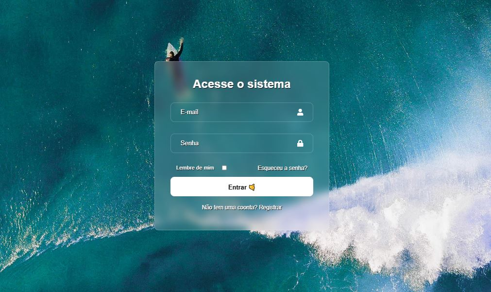

# 🔐 Tela de Login — Projeto em React

Este projeto é uma interface de **Tela de Login** desenvolvida com **React** como parte do meu aprendizado em React.js.

---

## 📸 Preview  

---

## 🎯 Objetivo do Projeto

Criar uma tela de autenticação funcional e bem estruturada utilizando **React**, explorando:

- Manipulação de formulário  
- Componentização    
- Organização de arquivos  
- Estilização em CSS  

O objetivo principal foi praticar a construção de interfaces modernas e responsivas usando boas práticas do ecossistema React.

---

## 🛠️ Tecnologias Utilizadas

- **React + Vite**
- **JavaScript (ES6+)**
- **CSS3**
- **Hooks do React (useState)**
- **Metodologia BEM** para organização de classes

---

## 🧠 O que eu aprendi

### ✔️ Fundamentos do React
- Implementação de componentes funcionais.
- Controle de estados com `useState`.
- Manipulação de inputs e eventos.

### ✔️ Estrutura da Interface
- Organização com padrões **BEM**, garantindo clareza e escalabilidade.
- Separação entre responsabilidades visuais e lógicas.
- Estruturação em componentes reutilizáveis.

---
